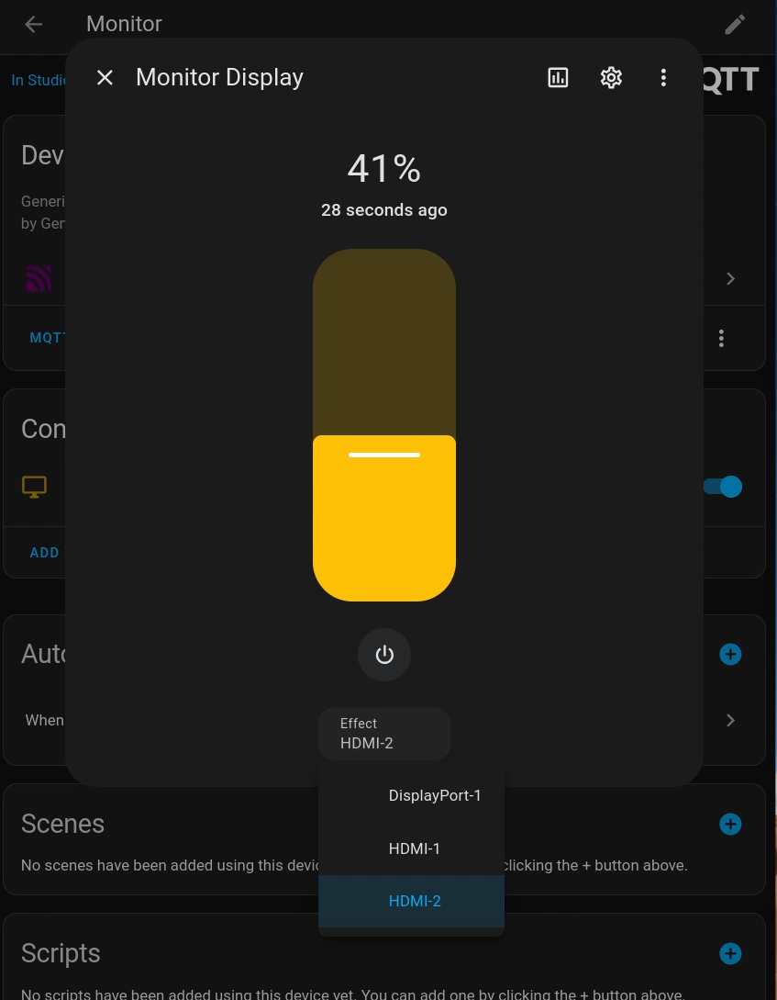

This script allows you to control your monitor's brightness, input, and power state via [Home Assistant](https://www.home-assistant.io/) using [MQTT](https://en.wikipedia.org/wiki/MQTT) and [the DDC/CI protocol](https://en.wikipedia.org/wiki/Display_Data_Channel).



The monitor can be controlled even if it is not the active input on the computer. This is useful for controlling a monitor that is connected to a different device, such as a Raspberry Pi or a game console.

Only supports Linux and single monitor setups.

## Pre-requisites
- Install the `paho-mqtt` library. `pip3 install paho-mqtt`
- Make sure `ddcutil` is installed and your user has permission to execute it without `sudo`.

## Installation
Copy the `mqttmonitorcontrol` directory to `/opt/`. The `main.py` file is your entry point. You can edit the configuration file to set your MQTT broker address, port, username, password, and display state polling interval.

Install this script as a systemd service to run on boot:
```ini
[Unit]
Description=MQTT Monitor Control
After=network.target

[Service]
Type=simple
ExecStart=/usr/bin/python3 /opt/mqttmonitorcontrol/main.py
WorkingDirectory=/opt/mqttmonitorcontrol
User=<your_username>
Group=<your_group>
Restart=always
StandardOutput=journal
StandardError=journal

[Install]
WantedBy=multi-user.target
```

```bash
# Copy and paste the service file to the systemd directory
`vim /etc/systemd/system/monitorcontrol.service`

# Reload systemd to recognize the new service
sudo systemctl daemon-reload

# Enable the service to start on boot
sudo systemctl enable monitorcontrol

# Start the service
sudo systemctl start monitorcontrol

# Check the status of the service
sudo systemctl status monitorcontrol
```

Ensure the following:
- Make sure you replace `<your_username>` and `<your_group>` with your actual username and group.
- Ensure `python3` is installed and the path to it is correct.
- Make sure the `WorkingDirectory` points to the directory where `main.py` is located.


